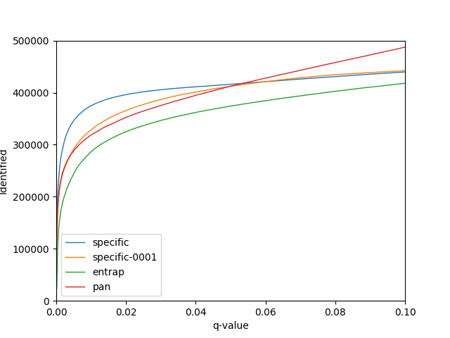

## Test of percolator against DIA wide window searches

Brian reported a problem with seeing an inflated error rate when using percolator on his narrow window
detected peptides when searching wide window data.

I plotted the number of matches as a function of $q$ value for the percolator trainings that BVrian provided for me, the specific series (using a DB of only the the narrow window peptides), the pan series (usding a DB of a generic pan-human peptides DB) and entrap (i.e. the narrow window peptides+extra shuffled peptides). Brian expected the entrap series to be better caibrated than the specific series.

I postulated that the percolator training procedure might not work as well as it should when using data with such low $\pi_0$ as the specific searches ($\hat{\pi_0}=0.1$). Hence I also tried to run percolator with a training FDR of 0.00001, alowing fewer incorrect pepties to be included as positive training examples.

 
